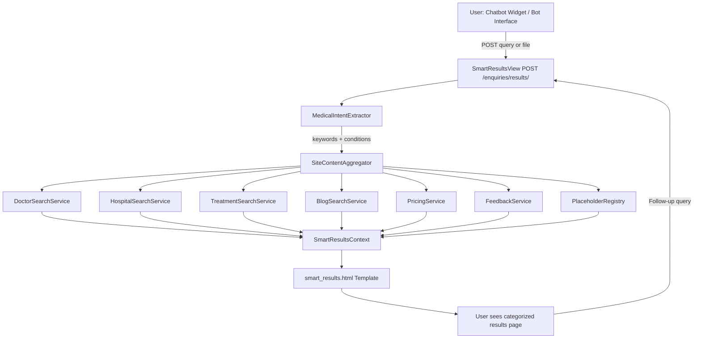
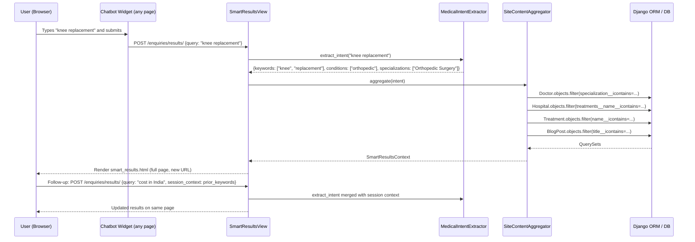
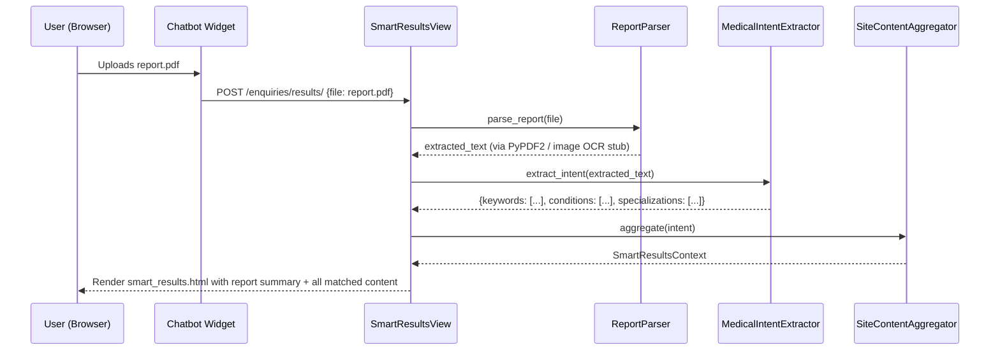

# Design Document: Chatbot Smart Results

## Overview

This feature transforms the existing TakeOpinion enquiry bot into a smart, context-aware assistant that analyzes medical reports and free-text queries, then surfaces all relevant website content — doctors, hospitals, treatments, blogs, pricing, and future content categories — on a dedicated results page. When a user submits any query or uploads a report in the chatbot, the browser navigates to a new `/enquiries/results/` page where all matched content is displayed and all subsequent interactions continue on that page.

The design covers two tightly coupled concerns: (1) the **Smart Search & Analysis Engine** that extracts medical intent from text and files, and (2) the **Smart Results Page** that renders matched content in categorized, extensible sections with placeholder slots for content categories that do not yet have data.

---

## Architecture



### Key Architectural Decisions

- **Single dedicated results URL** (`/enquiries/results/`) handles both GET (re-render with query param) and POST (new search). This keeps all follow-up queries on the same page without full-page reloads for subsequent searches (AJAX fallback available).
- **Intent extraction is server-side Python** — no external AI API dependency. Uses keyword matching + Django ORM `Q` filters, consistent with the existing `generate_bot_response` and `analyze_medical_report` patterns in `enquiry_bot/views.py`.
- **PlaceholderRegistry** is a simple Python list of content category definitions. When a category has zero results, the template renders a styled "Coming Soon" card instead of hiding the section. Future content automatically appears when DB records exist.
- **Session-based query context** stores the last extracted keywords so follow-up queries can be merged with prior context.

---

## Sequence Diagrams

### Flow 1: User Types a Condition/Treatment in Chatbot



### Flow 2: User Uploads a Medical Report



---

## Components and Interfaces

### Component 1: MedicalIntentExtractor

**Purpose**: Parse free text or extracted report text into structured medical intent — a set of keywords, detected medical conditions, and matched doctor specializations.

**Interface**:
```python
class MedicalIntent:
    keywords: list[str]          # raw search terms
    conditions: list[str]        # e.g. ["orthopedic", "cardiac"]
    specializations: list[str]   # e.g. ["Orthopedic Surgery", "Cardiology"]
    raw_query: str               # original user input

class MedicalIntentExtractor:
    def extract(self, text: str) -> MedicalIntent: ...
```

**Responsibilities**:
- Normalize and tokenize input text
- Match against a `CONDITION_SPECIALIZATION_MAP` dictionary (see Data Models)
- Return a `MedicalIntent` object used by all downstream services
- Merge with session-stored prior intent for follow-up queries

---

### Component 2: SiteContentAggregator

**Purpose**: Given a `MedicalIntent`, query all content models and return a unified `SmartResultsContext`.

**Interface**:
```python
class SmartResultsContext:
    query_summary: str
    doctors: QuerySet          # Doctor objects
    hospitals: QuerySet        # Hospital objects
    treatments: QuerySet       # Treatment objects
    blogs: QuerySet            # BlogPost objects
    pricing_data: list[dict]   # {treatment, hospital, price}
    feedbacks: QuerySet        # Feedback objects
    placeholders: list[dict]   # sections with no current data
    intent: MedicalIntent

class SiteContentAggregator:
    def aggregate(self, intent: MedicalIntent) -> SmartResultsContext: ...
```

**Responsibilities**:
- Call each search service with the intent
- Collect results and pass to `PlaceholderRegistry` to determine which sections are empty
- Return a single context object for the template

---

### Component 3: SmartResultsView

**Purpose**: Django view at `GET/POST /enquiries/results/` that orchestrates the full pipeline and renders the results page.

**Interface**:
```python
def smart_results_view(request: HttpRequest) -> HttpResponse: ...
def smart_results_api(request: HttpRequest) -> JsonResponse: ...  # AJAX endpoint for follow-up queries
```

**Responsibilities**:
- Accept `query` (text) or `medical_report` (file) from POST body
- Accept `q` query param for GET (shareable links, browser back/forward)
- Delegate to `ReportParser` if a file is uploaded
- Call `MedicalIntentExtractor` then `SiteContentAggregator`
- Store intent keywords in `request.session['chatbot_context']`
- Render `enquiry_bot/smart_results.html`

---

### Component 4: ReportParser

**Purpose**: Extract plain text from uploaded medical report files (PDF, images).

**Interface**:
```python
class ReportParser:
    def parse(self, uploaded_file: InMemoryUploadedFile) -> str: ...
```

**Responsibilities**:
- Handle `application/pdf` via `PyPDF2` (already a dependency in the project)
- Handle image files (`image/jpeg`, `image/png`) — return a stub text for now; OCR can be plugged in later
- Handle plain text files directly
- Raise `ReportParseError` on unsupported formats

---

### Component 5: PlaceholderRegistry

**Purpose**: Define all content categories the results page should always show, even when empty.

**Interface**:
```python
PLACEHOLDER_CATEGORIES: list[dict] = [
    {"key": "doctors",    "label": "Specialist Doctors",   "icon": "bi-person-badge",  "url": "/doctors/"},
    {"key": "hospitals",  "label": "Hospitals",            "icon": "bi-building",      "url": "/hospitals/"},
    {"key": "treatments", "label": "Treatments",           "icon": "bi-bandaid",       "url": "/treatments/"},
    {"key": "blogs",      "label": "Health Articles",      "icon": "bi-journal-text",  "url": "/blogs/"},
    {"key": "pricing",    "label": "Pricing & Packages",   "icon": "bi-currency-rupee","url": "/pricing/"},
    {"key": "feedbacks",  "label": "Patient Reviews",      "icon": "bi-star",          "url": "/feedbacks/"},
    # Future categories — add here; template renders automatically
    {"key": "videos",     "label": "Video Consultations",  "icon": "bi-camera-video",  "url": "#"},
    {"key": "packages",   "label": "Medical Packages",     "icon": "bi-box-seam",      "url": "#"},
    {"key": "hotels",     "label": "Nearby Hotels",        "icon": "bi-house",         "url": "/hotels/"},
    {"key": "insurance",  "label": "Insurance & Finance",  "icon": "bi-shield-check",  "url": "#"},
]

class PlaceholderRegistry:
    def get_placeholders(self, context: SmartResultsContext) -> list[dict]: ...
```

**Responsibilities**:
- Compare each category key against the aggregated results
- Mark categories with zero results as `{"has_data": False, "coming_soon": True}`
- Mark categories with results as `{"has_data": True, "items": queryset}`
- New categories added to `PLACEHOLDER_CATEGORIES` automatically appear on the results page

---

### Component 6: Chatbot Trigger (Frontend)

**Purpose**: Intercept the first user submission in the existing chatbot widget and redirect to the results page instead of responding inline.

**Interface** (JavaScript):
```javascript
function handleChatbotSubmit(query, fileInput) {
    // Build a form and POST to /enquiries/results/
    // Browser navigates to the new page
}
```

**Responsibilities**:
- Attach to the existing `#send-button` click and `#message-input` Enter key in `bot_interface.html`
- If a file is attached, use `FormData` for multipart POST
- After the first navigation, all subsequent queries happen on `smart_results.html` via its own input form


---

## Data Models

### Existing Models Used (No Schema Changes Required)

| Model | App | Key Fields Used |
|---|---|---|
| `Doctor` | `doctors` | `name`, `slug`, `specialization`, `rating`, `profile_picture`, `hospitals`, `treatments` |
| `Hospital` | `hospitals` | `name`, `slug`, `city`, `state`, `country`, `rating`, `starting_price`, `treatments`, `doctors` |
| `Treatment` | `treatments` | `name`, `slug`, `description`, `category`, `starting_price` |
| `BlogPost` | `blogs` | `title`, `slug`, `content`, `treatment`, `doctor`, `hospital` |
| `Feedback` | `feedbacks` | `rating`, `comment`, `doctor`, `hospital`, `treatment`, `is_approved` |
| `Enquiry` | `enquiry_bot` | `subject`, `message`, `user` |
| `ChatMessage` | `enquiry_bot` | `enquiry`, `sender_type`, `message` |

### New Model: `ChatbotSearchSession`

Stores the extracted intent per session so follow-up queries can be contextually merged.

```python
class ChatbotSearchSession(models.Model):
    session_key = models.CharField(max_length=40, db_index=True)
    raw_query = models.TextField()
    extracted_keywords = models.JSONField(default=list)   # ["knee", "replacement"]
    extracted_conditions = models.JSONField(default=list) # ["orthopedic"]
    report_text_summary = models.TextField(blank=True)    # first 500 chars of parsed report
    created_at = models.DateTimeField(auto_now_add=True)
    updated_at = models.DateTimeField(auto_now=True)

    class Meta:
        ordering = ["-updated_at"]

    def __str__(self):
        return f"Session {self.session_key}: {self.raw_query[:60]}"
```

### CONDITION_SPECIALIZATION_MAP (Python dict, not a DB model)

```python
CONDITION_SPECIALIZATION_MAP = {
    # Cardiac
    "heart":          ["Cardiology", "Cardiac Surgery", "Cardiovascular Surgery"],
    "cardiac":        ["Cardiology", "Cardiac Surgery"],
    "hypertension":   ["Cardiology", "Internal Medicine"],
    "blood pressure": ["Cardiology", "Internal Medicine"],
    # Orthopedic
    "knee":           ["Orthopedic Surgery", "Joint Replacement"],
    "joint":          ["Orthopedic Surgery", "Rheumatology"],
    "bone":           ["Orthopedic Surgery"],
    "arthritis":      ["Orthopedic Surgery", "Rheumatology"],
    "spine":          ["Spine Surgery", "Neurosurgery"],
    # Neuro
    "brain":          ["Neurology", "Neurosurgery"],
    "neuro":          ["Neurology", "Neurosurgery"],
    "stroke":         ["Neurology"],
    # Oncology
    "cancer":         ["Oncology", "Surgical Oncology"],
    "tumor":          ["Oncology", "Neurosurgery"],
    # Endocrine
    "diabetes":       ["Endocrinology", "Internal Medicine", "General Medicine"],
    "thyroid":        ["Endocrinology"],
    # Gastro
    "liver":          ["Gastroenterology", "Hepatology"],
    "stomach":        ["Gastroenterology"],
    "gastro":         ["Gastroenterology"],
    # Urology / Nephrology
    "kidney":         ["Nephrology", "Urology"],
    "urology":        ["Urology"],
    # Ophthalmology
    "eye":            ["Ophthalmology"],
    "cataract":       ["Ophthalmology"],
    # Cosmetic / Aesthetic
    "cosmetic":       ["Plastic Surgery", "Aesthetic Medicine"],
    "rhinoplasty":    ["Plastic Surgery"],
    # Dental
    "dental":         ["Dentistry"],
    "teeth":          ["Dentistry"],
    # Fertility
    "ivf":            ["Fertility", "Reproductive Medicine"],
    "fertility":      ["Fertility", "Reproductive Medicine"],
    # General
    "surgery":        [],   # broad — match all surgical specializations
    "treatment":      [],   # broad — match all
}
```

---

## Algorithmic Pseudocode

### Main Processing Algorithm: `smart_results_view`

```pascal
PROCEDURE smart_results_view(request)
  INPUT: request (HttpRequest with POST body or GET params)
  OUTPUT: HttpResponse (rendered smart_results.html)

  SEQUENCE
    // Step 1: Extract raw input
    IF request.method = 'POST' THEN
      query_text ← request.POST.get('query', '')
      uploaded_file ← request.FILES.get('medical_report', NULL)
    ELSE
      query_text ← request.GET.get('q', '')
      uploaded_file ← NULL
    END IF

    // Step 2: Parse report if file uploaded
    report_summary ← ''
    IF uploaded_file IS NOT NULL THEN
      parser ← ReportParser()
      report_text ← parser.parse(uploaded_file)
      report_summary ← report_text[:500]
      query_text ← query_text + ' ' + report_text
    END IF

    // Step 3: Merge with session context
    prior_keywords ← request.session.get('chatbot_context', [])
    full_text ← merge_with_context(query_text, prior_keywords)

    // Step 4: Extract intent
    extractor ← MedicalIntentExtractor()
    intent ← extractor.extract(full_text)

    // Step 5: Persist session context
    request.session['chatbot_context'] ← intent.keywords
    ChatbotSearchSession.objects.update_or_create(
      session_key=request.session.session_key,
      defaults={raw_query: query_text, extracted_keywords: intent.keywords, ...}
    )

    // Step 6: Aggregate site content
    aggregator ← SiteContentAggregator()
    results_context ← aggregator.aggregate(intent)
    results_context.report_summary ← report_summary

    // Step 7: Render
    RETURN render(request, 'enquiry_bot/smart_results.html', results_context)
  END SEQUENCE
END PROCEDURE
```

**Preconditions:**
- `request` is a valid Django `HttpRequest`
- Session middleware is active (always true in this project)

**Postconditions:**
- Returns a rendered HTML page with all matched content sections
- Session stores extracted keywords for follow-up context
- A `ChatbotSearchSession` record is created or updated

---

### Algorithm: `MedicalIntentExtractor.extract`

```pascal
PROCEDURE extract(text)
  INPUT: text (String — raw query or parsed report text)
  OUTPUT: MedicalIntent

  SEQUENCE
    text_lower ← text.lower().strip()
    keywords ← []
    conditions ← []
    specializations ← []

    // Tokenize: split on whitespace and punctuation
    tokens ← tokenize(text_lower)

    // Single-token matching
    FOR each token IN tokens DO
      IF token IN CONDITION_SPECIALIZATION_MAP THEN
        keywords.append(token)
        conditions.append(token)
        specializations.extend(CONDITION_SPECIALIZATION_MAP[token])
      END IF
    END FOR

    // Bigram matching (e.g. "blood pressure", "knee replacement")
    FOR i FROM 0 TO len(tokens) - 2 DO
      bigram ← tokens[i] + ' ' + tokens[i+1]
      IF bigram IN CONDITION_SPECIALIZATION_MAP THEN
        keywords.append(bigram)
        conditions.append(bigram)
        specializations.extend(CONDITION_SPECIALIZATION_MAP[bigram])
      END IF
    END FOR

    // Deduplicate
    keywords ← unique(keywords)
    conditions ← unique(conditions)
    specializations ← unique(specializations)

    // Fallback: if no conditions matched, use raw tokens as keywords
    IF len(keywords) = 0 THEN
      keywords ← tokens[:5]   // first 5 tokens as generic search terms
    END IF

    RETURN MedicalIntent(
      keywords=keywords,
      conditions=conditions,
      specializations=specializations,
      raw_query=text
    )
  END SEQUENCE
END PROCEDURE
```

**Preconditions:**
- `text` is a non-null string (may be empty)
- `CONDITION_SPECIALIZATION_MAP` is loaded

**Postconditions:**
- Returns a `MedicalIntent` with at least `raw_query` populated
- `keywords` is never None (may be empty list)

**Loop Invariants:**
- All previously processed tokens have been checked against the map
- `specializations` contains only values from `CONDITION_SPECIALIZATION_MAP`

---

### Algorithm: `SiteContentAggregator.aggregate`

```pascal
PROCEDURE aggregate(intent)
  INPUT: intent (MedicalIntent)
  OUTPUT: SmartResultsContext

  SEQUENCE
    keywords ← intent.keywords
    specializations ← intent.specializations
    raw_query ← intent.raw_query

    // Build shared Q filter for text search
    text_q ← Q()
    FOR each kw IN keywords DO
      text_q ← text_q | Q(name__icontains=kw)
    END FOR
    IF len(keywords) = 0 THEN
      text_q ← Q(pk__isnull=False)   // match all
    END IF

    // Doctors: match by specialization first, then name/key_points
    spec_q ← Q()
    FOR each spec IN specializations DO
      spec_q ← spec_q | Q(specialization__icontains=spec)
    END FOR
    doctor_q ← spec_q | text_q | Q(key_points__icontains=raw_query)
    doctors ← Doctor.objects.filter(doctor_q).distinct()[:6]

    // Hospitals: match by treatments they offer
    treatment_q ← Q()
    FOR each kw IN keywords DO
      treatment_q ← treatment_q | Q(treatments__name__icontains=kw)
    END FOR
    hospital_q ← treatment_q | Q(name__icontains=raw_query) | Q(about__icontains=raw_query)
    hospitals ← Hospital.objects.filter(hospital_q).distinct().order_by('-rating')[:6]

    // Treatments: match by name and description
    treat_q ← Q()
    FOR each kw IN keywords DO
      treat_q ← treat_q | Q(name__icontains=kw) | Q(description__icontains=kw)
    END FOR
    treatments ← Treatment.objects.filter(treat_q).distinct()[:6]

    // Blogs: match by title and content
    blog_q ← Q()
    FOR each kw IN keywords DO
      blog_q ← blog_q | Q(title__icontains=kw) | Q(content__icontains=kw)
    END FOR
    blogs ← BlogPost.objects.filter(blog_q).distinct()[:4]

    // Pricing: treatments with starting_price, linked to hospitals
    pricing_data ← build_pricing_data(treatments, hospitals)

    // Feedbacks: approved reviews for matched doctors/hospitals/treatments
    feedback_q ← Q(is_approved=True)
    IF len(doctors) > 0 THEN
      feedback_q ← feedback_q & Q(doctor__in=doctors)
    END IF
    feedbacks ← Feedback.objects.filter(feedback_q)[:4]

    // Placeholders
    registry ← PlaceholderRegistry()
    context_dict ← {doctors, hospitals, treatments, blogs, pricing_data, feedbacks}
    placeholders ← registry.get_placeholders(context_dict)

    RETURN SmartResultsContext(
      query_summary=build_query_summary(intent),
      doctors=doctors,
      hospitals=hospitals,
      treatments=treatments,
      blogs=blogs,
      pricing_data=pricing_data,
      feedbacks=feedbacks,
      placeholders=placeholders,
      intent=intent
    )
  END SEQUENCE
END PROCEDURE
```

**Preconditions:**
- `intent` is a valid `MedicalIntent` object
- All Django models are accessible

**Postconditions:**
- All QuerySets are evaluated lazily (not yet hit DB until template renders)
- `placeholders` covers all categories in `PLACEHOLDER_CATEGORIES`
- Result counts are bounded (max 6 per category) to keep page performant

**Loop Invariants:**
- Each keyword is applied to all relevant model fields before moving to the next
- `distinct()` is called after all `Q` filters to prevent duplicate rows from M2M joins


---

## Key Functions with Formal Specifications

### `smart_results_view(request)`

```python
def smart_results_view(request: HttpRequest) -> HttpResponse
```

**Preconditions:**
- `request.method` is `'GET'` or `'POST'`
- Session middleware is active
- At least one of `request.POST.get('query')` or `request.FILES.get('medical_report')` or `request.GET.get('q')` is present (may be empty string)

**Postconditions:**
- Returns HTTP 200 with rendered `smart_results.html`
- `request.session['chatbot_context']` is updated with latest keywords
- A `ChatbotSearchSession` record exists for `request.session.session_key`

---

### `MedicalIntentExtractor.extract(text)`

```python
def extract(self, text: str) -> MedicalIntent
```

**Preconditions:**
- `text` is a `str` (may be empty)

**Postconditions:**
- `result.raw_query == text`
- `result.keywords` is a `list[str]` (possibly empty)
- `result.specializations` is a subset of all values in `CONDITION_SPECIALIZATION_MAP`
- If `text` is empty: `result.keywords == []`, `result.conditions == []`

---

### `SiteContentAggregator.aggregate(intent)`

```python
def aggregate(self, intent: MedicalIntent) -> SmartResultsContext
```

**Preconditions:**
- `intent` is a valid `MedicalIntent` instance
- Django ORM is available

**Postconditions:**
- `result.doctors` contains at most 6 `Doctor` objects
- `result.hospitals` contains at most 6 `Hospital` objects ordered by `-rating`
- `result.treatments` contains at most 6 `Treatment` objects
- `result.blogs` contains at most 4 `BlogPost` objects
- `result.placeholders` covers every key in `PLACEHOLDER_CATEGORIES`
- No duplicate objects within any single result list

---

### `ReportParser.parse(uploaded_file)`

```python
def parse(self, uploaded_file: InMemoryUploadedFile) -> str
```

**Preconditions:**
- `uploaded_file` is not None
- `uploaded_file.content_type` is one of: `application/pdf`, `image/jpeg`, `image/png`, `image/gif`, `text/plain`

**Postconditions:**
- Returns a non-None `str` (may be empty if extraction yields nothing)
- Does not mutate `uploaded_file`
- Raises `ReportParseError` if content type is unsupported

---

### `PlaceholderRegistry.get_placeholders(context_dict)`

```python
def get_placeholders(self, context_dict: dict) -> list[dict]
```

**Preconditions:**
- `context_dict` has keys matching `PLACEHOLDER_CATEGORIES[*]["key"]`

**Postconditions:**
- Returns a list with exactly `len(PLACEHOLDER_CATEGORIES)` entries
- Each entry has `has_data: bool` and `coming_soon: bool`
- If `context_dict[key]` is empty/falsy → `has_data=False, coming_soon=True`
- If `context_dict[key]` is non-empty → `has_data=True, coming_soon=False`

---

## Example Usage

### Example 1: User types "knee replacement cost India"

```python
# In smart_results_view
extractor = MedicalIntentExtractor()
intent = extractor.extract("knee replacement cost India")
# intent.keywords = ["knee", "replacement"]
# intent.conditions = ["knee", "joint"]
# intent.specializations = ["Orthopedic Surgery", "Joint Replacement"]

aggregator = SiteContentAggregator()
ctx = aggregator.aggregate(intent)
# ctx.doctors → Doctors with specialization containing "Orthopedic"
# ctx.hospitals → Hospitals offering knee/joint treatments
# ctx.treatments → Treatments named "Knee Replacement", "Joint Replacement"
# ctx.blogs → Blog posts about knee surgery
# ctx.pricing_data → [{treatment: "Knee Replacement", hospital: "Apollo", price: 350000}, ...]
```

### Example 2: User uploads a PDF report mentioning "Type 2 Diabetes, HbA1c 9.2"

```python
parser = ReportParser()
text = parser.parse(uploaded_pdf)
# text = "Patient: John Doe\nDiagnosis: Type 2 Diabetes Mellitus\nHbA1c: 9.2%\n..."

intent = extractor.extract(text)
# intent.keywords = ["diabetes"]
# intent.specializations = ["Endocrinology", "Internal Medicine", "General Medicine"]

ctx = aggregator.aggregate(intent)
# ctx.doctors → Endocrinologists and Internal Medicine specialists
# ctx.treatments → Diabetes management treatments
# ctx.report_summary = "Patient: John Doe\nDiagnosis: Type 2 Diabetes..."
```

### Example 3: Follow-up query on results page

```python
# User already searched "diabetes", session has keywords=["diabetes"]
# User now types "best hospital in Delhi"

prior_keywords = request.session.get('chatbot_context', [])  # ["diabetes"]
merged_text = "best hospital in Delhi " + " ".join(prior_keywords)
intent = extractor.extract(merged_text)
# intent.keywords = ["diabetes", "hospital", "delhi"]
# Results now filtered for diabetes specialists in Delhi hospitals
```

### Example 4: Empty query (no keywords matched)

```python
intent = extractor.extract("hello")
# intent.keywords = ["hello"]  # fallback: raw tokens
# intent.specializations = []

ctx = aggregator.aggregate(intent)
# All Q filters are broad — returns top-rated doctors, hospitals, treatments
# All placeholder sections show "Coming Soon" for categories with no DB data
```

---

## Correctness Properties

1. **Completeness**: For every category in `PLACEHOLDER_CATEGORIES`, the results page always renders a section — either with matched content or a "Coming Soon" placeholder. No category is silently omitted.

2. **Idempotency**: Submitting the same query twice produces the same results (given unchanged DB state). The session context does not accumulate duplicate keywords.

3. **Bounded results**: Each content category returns at most N items (doctors: 6, hospitals: 6, treatments: 6, blogs: 4, feedbacks: 4). The page never renders unbounded lists.

4. **Safe fallback**: If `MedicalIntentExtractor` finds no matching conditions, the aggregator falls back to a broad search using raw tokens, ensuring the results page is never completely empty when the DB has content.

5. **Report parse safety**: `ReportParser.parse` never raises an unhandled exception to the view. All parse errors are caught and return an empty string, allowing the view to continue with whatever text was typed.

6. **Session isolation**: `chatbot_context` in the session is scoped to `session_key`. Two different users' sessions never share extracted keywords.

7. **Future content auto-display**: Adding a new entry to `PLACEHOLDER_CATEGORIES` and populating the corresponding DB model is sufficient for the new category to appear on the results page — no template changes required.

---

## Error Handling

### Error Scenario 1: Unsupported File Type

**Condition**: User uploads a `.docx` or `.xlsx` file  
**Response**: `ReportParser` raises `ReportParseError`; view catches it and sets `report_summary = ""`, continues with any typed query text  
**Recovery**: User sees results based on typed query; a warning message is shown: "We couldn't read your file format. Please upload PDF, JPG, or PNG."

### Error Scenario 2: Empty Query and No File

**Condition**: User submits the form with no text and no file  
**Response**: `MedicalIntentExtractor.extract("")` returns empty intent; `SiteContentAggregator` returns top-rated content across all categories  
**Recovery**: Results page shows general top content with a prompt: "Try searching for a condition, treatment, or doctor name."

### Error Scenario 3: Database Query Error

**Condition**: ORM query fails (e.g., DB connection issue)  
**Response**: View catches `DatabaseError`, logs it, returns results page with all sections as placeholders  
**Recovery**: User sees "Coming Soon" for all sections; error is logged for admin review

### Error Scenario 4: PDF Parsing Failure

**Condition**: Corrupted or password-protected PDF  
**Response**: `PyPDF2` raises an exception; `ReportParser` catches it and returns empty string  
**Recovery**: View continues with typed query text only; user is informed the report could not be read

### Error Scenario 5: Session Not Available

**Condition**: Session middleware misconfigured or session expired  
**Response**: `request.session.get('chatbot_context', [])` returns `[]` safely  
**Recovery**: Query proceeds without prior context; no crash

---

## Testing Strategy

### Unit Testing Approach

- Test `MedicalIntentExtractor.extract` with known inputs: cardiac terms, orthopedic terms, empty string, numeric-only input, mixed language (Hindi transliteration like "dil ki bimari")
- Test `ReportParser.parse` with a sample PDF, a JPEG stub, and an unsupported format
- Test `PlaceholderRegistry.get_placeholders` with fully populated context, partially populated, and empty context
- Test `SiteContentAggregator.aggregate` with mocked QuerySets to verify Q filter construction

### Property-Based Testing Approach

**Property Test Library**: `hypothesis`

- **Property 1**: For any non-empty string `text`, `extract(text).raw_query == text`
- **Property 2**: For any `text`, `len(extract(text).specializations) >= 0` and all values are in `CONDITION_SPECIALIZATION_MAP` values
- **Property 3**: For any `intent`, `len(aggregate(intent).doctors) <= 6`
- **Property 4**: `len(get_placeholders(ctx)) == len(PLACEHOLDER_CATEGORIES)` for any `ctx`

### Integration Testing Approach

- End-to-end test: POST to `/enquiries/results/` with `query="knee replacement"` → assert response contains doctor cards, treatment cards, and placeholder sections
- Test the chatbot widget redirect: simulate click on send button → assert browser navigates to `/enquiries/results/?q=...`
- Test follow-up query: POST twice with different queries → assert session context merges keywords

---

## Performance Considerations

- All ORM queries use `distinct()` and are bounded with `[:N]` slices to prevent full-table scans on large datasets
- `select_related` and `prefetch_related` are used on Doctor (hospitals, treatments) and Hospital (treatments, doctors) to avoid N+1 queries
- The results page does not paginate on first load (max 6 per section); a "View All" link per section points to the existing list pages (`/doctors/`, `/hospitals/`, etc.)
- `ChatbotSearchSession` records older than 30 days can be purged via a management command (future task)
- The `CONDITION_SPECIALIZATION_MAP` is a module-level constant — loaded once at startup, no DB hit

---

## Security Considerations

- File uploads are validated by content type and size before parsing (max 10 MB)
- Uploaded files are read into memory and not persisted to disk unless explicitly saved to `MedicalReport` (existing model)
- All ORM queries use parameterized filters via Django's `Q` objects — no raw SQL, no injection risk
- The results page URL (`/enquiries/results/?q=...`) does not expose session data; keywords are stored server-side in the session
- CSRF protection is maintained on the POST form (Django's ``)
- Report text extracted from PDFs is treated as untrusted input — it is only used as search keywords, never rendered as raw HTML

---

## Dependencies

| Dependency | Already in Project | Purpose |
|---|---|---|
| `PyPDF2` | Yes (used in `enquiry_bot/views.py`) | PDF text extraction |
| `Pillow` (`PIL`) | Yes (used in `enquiry_bot/views.py`) | Image file handling |
| `Django` sessions | Yes | Storing chatbot context between requests |
| `django.db.models.Q` | Yes | Complex ORM filter construction |
| `hypothesis` | No — add to `requirements.txt` | Property-based testing |

No new external API dependencies are introduced. The feature works entirely with the existing Django ORM and installed packages.

---

## URL Structure

```
GET  /enquiries/results/?q=knee+replacement     → SmartResultsView (shareable link)
POST /enquiries/results/                        → SmartResultsView (form submit / file upload)
POST /enquiries/results/api/                    → smart_results_api (AJAX for follow-up, returns JSON)
```

These are added to `enquiry_bot/urls.py` alongside existing routes.

---

## Template Structure: `smart_results.html`

```
enquiry_bot/templates/enquiry_bot/smart_results.html
├── extends base.html
├── Search bar (pre-filled with current query, POST to same URL)
├── Report upload button
├── Query summary banner ("Showing results for: knee replacement")
├── Report summary card (if file was uploaded)
├── 
│   ├── if section.has_data:
│   │   └── Render content cards (doctor cards, hospital cards, etc.)
│   └── else:
│       └── "Coming Soon" placeholder card with icon + label
└── 
```

The `placeholders` list drives the entire page layout. Each section is self-contained. Adding a new category to `PLACEHOLDER_CATEGORIES` and populating its DB model is the only step needed to make new content appear.
